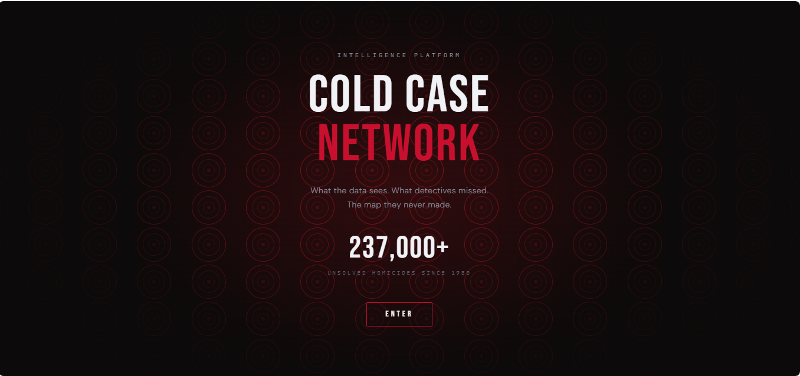

# Cold Case Network

> Geographic intelligence tool that surfaces clusters of unsolved homicides hidden across jurisdictional boundaries, using FBI Supplementary Homicide Report data from 1976 to 2023.



**Live:** [cold-case-flame.vercel.app](https://cold-case-flame.vercel.app/)

## The Problem

There are over 250,000 unsolved homicides in the US since 1976. Serial patterns often go undetected because cases are investigated by separate jurisdictions that don't share data. A cluster of unsolved cases spanning two counties might never get connected because no single department sees the full picture. The FBI's Supplementary Homicide Report contains 894,636 records, but there's no public tool that maps these geographically to reveal patterns across boundaries.

## What It Does

Cold Case Network plots unsolved homicides on an interactive map and surfaces geographic clusters that span jurisdictional lines. Investigators and data journalists can filter by year range, weapon type, victim demographics, and clearance status, then drill into individual clusters to see case-level detail. The map uses a progressive reveal system so users can zoom from national patterns down to neighborhood-level clusters.

## Key Features

| Feature | Description |
| --- | --- |
| Geographic Clustering | Surfaces spatial clusters of unsolved homicides that cross city, county, and state lines |
| Progressive Map Reveal | National overview zooms down to neighborhood-level case markers with smooth transitions |
| Filter System | Filter by year range, weapon, victim demographics, and solve status |
| Case File Panel | Click any cluster to see individual case details with victim info, weapon, and circumstances |
| Data Confidence Badges | State-level reporting rate indicators so users know where data gaps exist |
| Real Supabase Data | 894,636 FBI SHR records served via RPC, not mock data |

## Tech Stack

| Layer | Tools | Why |
| --- | --- | --- |
| Frontend | Next.js 15, TypeScript | App Router for file-based routing, TypeScript for type safety across 894K records |
| Styling | Tailwind CSS | Rapid iteration on responsive filter panels and case detail cards |
| State | Zustand | Isolated stores for map viewport, active filters, and selected cluster without prop drilling |
| Maps | Mapbox GL JS | WebGL rendering handles tens of thousands of case markers with smooth clustering at every zoom level |
| Database | Supabase (PostgreSQL + PostGIS) | RPC functions for spatial cluster queries on 894K geocoded records |
| Deployment | Vercel | Zero-config Next.js deploys with preview URLs per branch |

## Architecture

```
User (Browser)
│
├── Filter Controls ──→ Zustand (filterStore)
│                              │
│                    ┌─────────▼──────────┐
│                    │   Supabase RPC     │
│                    │   (PostGIS queries)│
│                    │   894,636 records  │
│                    └─────────┬──────────┘
│                              │
├── Map View ←──── Mapbox GL JS (clustered markers)
│
└── Case File Panel ←── Selected cluster detail
```

## Technical Decisions

- **Supabase RPC over direct table queries** — With 894K records, client-side filtering would be unusable. RPC functions push the spatial logic (`ST_ClusterDBSCAN`, `ST_Within`) to PostGIS where it runs in milliseconds. The frontend only receives pre-clustered results.
- **Zustand over React Context for filter state** — Filters, map viewport, and selected cluster are three independent domains. Zustand stores keep each isolated and accessible outside React components (needed for Mapbox event handlers that fire outside the React tree).
- **Progressive map reveal over loading all markers at once** — Rendering 894K points on initial load would freeze the browser. The progressive system loads national clusters first, then fetches finer-grained data as the user zooms, keeping the map responsive at every scale.

## Getting Started

```bash
git clone https://github.com/jonelrichardson/cold-case.git
cd cold-case
npm install
```

Create `.env.local`:

```
NEXT_PUBLIC_SUPABASE_URL=your_url_here
NEXT_PUBLIC_SUPABASE_ANON_KEY=your_key_here
NEXT_PUBLIC_MAPBOX_TOKEN=your_token_here
```

```bash
npm run dev
# Open http://localhost:3000
```

## Data Sources

- **SHR65_23.csv** — 894,636 records (1976–2023) from Murder Accountability Project
- **UCR65_23a.sav** — FBI agency-level clearance rates, ORI→FIPS mapping
- **State_Reporting_Rates_2022.xlsx** — Data confidence badges by state

## What I'd Build Next

- Cross-jurisdictional alert system that flags when a new unsolved case matches the profile of an existing cluster
- Timeline visualization showing how clusters formed over decades
- Exportable case reports for law enforcement with cluster analysis and victim pattern summaries

## About This Project

Built as a capstone project during Pursuit's AI-Native Builder Fellowship, presented at Demo Day on March 18, 2026. Two-person team with 189 passing tests and type-check clean status across 7 build phases.

**My role:** Full frontend owner. Built the Mapbox GL map with progressive reveal and clustering, filter UI with Zustand state management, case file detail panel, and all component architecture. Manny owned the backend: data loading pipeline, Supabase schema design, PostGIS cluster queries, and geocoding.

---

Built by [Jonel Richardson](https://linkedin.com/in/jonel-richardson)
